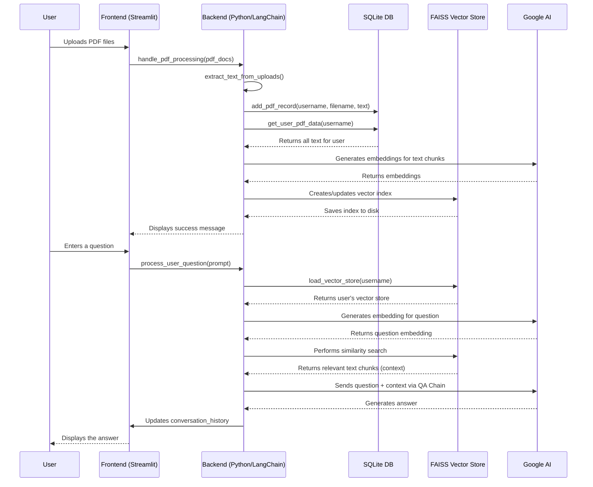

# Technical Documentation: RAG-with-PDF Streamlit Application

**Version:** 1.0
**Date:** 2025-07-23

## 1. Project Overview

This document provides a comprehensive technical overview of the RAG-with-PDF application, a Python-based tool built with Streamlit and LangChain. The application's primary purpose is to enable users to "chat" with their PDF documents. It leverages a Retrieval-Augmented Generation (RAG) architecture to provide contextually relevant answers based on the content of user-uploaded PDFs.

The core objectives of this project are:
-   To provide a secure, multi-user environment where individuals can interact with their private documents.
-   To utilize state-of-the-art language models for question-answering while ensuring responses are strictly grounded in the provided text.
-   To offer a simple, intuitive user interface for uploading documents and interacting with the chat system.
-   To create a persistent, user-specific knowledge base that can be queried across multiple sessions.

This documentation is intended for Python developers with an intermediate understanding of web frameworks and a basic familiarity with AI/ML concepts.

## 2. System Architecture

The application is built on a three-tier architecture:

1.  **Frontend (UI Layer):** Developed using **Streamlit**, this layer is responsible for all user interactions. It handles user registration/login, file uploads, chat history display, and user input. The UI is dynamically rendered based on the user's authentication state and session data.

2.  **Backend (Application Logic):** This layer, written in Python, orchestrates the entire workflow. It manages session state, processes user requests, and integrates the various components. Key modules include:
    *   `app.py`: The main entry point of the Streamlit application.
    *   `auth.py`: Handles user authentication, registration, and database interactions.
    *   `utils.py`: Contains the core logic for PDF processing, vector store management, and the LangChain RAG implementation.
    *   `ui.py`: Manages the visual components and CSS styling of the Streamlit interface.
    *   `config.py`: Stores all configuration constants for the application.

3.  **Data Layer:** This layer consists of two main components:
    *   **SQLite Database (`user_data.db`):** A relational database used to store user credentials (username, API key) and metadata about their uploaded PDFs (filename, upload timestamp, extracted text). This ensures data persistence across sessions.
    *   **FAISS Vector Store:** A user-specific vector database created and managed by LangChain. It stores the vectorized embeddings of the text chunks extracted from the user's PDFs, enabling efficient similarity searches. Each user has a dedicated FAISS index stored on the filesystem.

## 3. Functional Components

### 3.1. Authentication and User Management (`auth.py`)

-   **Database Initialization (`init_db`):** On startup, this function creates the SQLite database and the necessary tables (`users`, `user_pdfs`) if they don't exist. It also ensures the base directory for FAISS vector stores is created.
-   **User Registration (`add_user`, `update_api_key`):** New users are created by providing a username and a Google API key. The username is stored, and the API key is updated in the `users` table.
-   **User Login (`render_login_page`, `get_user`):** Existing users log in with their username. The system retrieves their stored API key from the database to authenticate them. The login page dynamically adjusts to request an API key for new users or for existing users who haven't provided one.
-   **Session Management:** Streamlit's `session_state` is used extensively to track the user's login status, username, API key, and conversation history.

### 3.2. PDF Processing and Vectorization (`utils.py`)

-   **Text Extraction (`extract_text_from_uploads`):** Uses the `PyPDF2` library to extract raw text from each page of the uploaded PDF files.
-   **Text Chunking (`RecursiveCharacterTextSplitter`):** The extracted text is split into smaller, overlapping chunks. This is a crucial step in the RAG pipeline, as it allows the model to process relevant, bite-sized pieces of context rather than entire documents.
-   **Embedding Generation (`GoogleGenerativeAIEmbeddings`):** Each text chunk is converted into a high-dimensional vector (embedding) using Google's `embedding-001` model via LangChain. These embeddings capture the semantic meaning of the text.
-   **Vector Store Creation (`FAISS`):** The generated embeddings are stored in a FAISS (Facebook AI Similarity Search) index. FAISS is highly efficient for searching and retrieving vectors that are most similar to a query vector. The vector store is saved locally in a directory specific to the user.

### 3.3. Question-Answering (`utils.py`)

-   **Similarity Search:** When a user asks a question, their query is first converted into an embedding using the same model. The FAISS vector store is then searched to find the text chunks with embeddings most similar to the query's embedding. The `as_retriever` method with "mmr" (Maximal Marginal Relevance) is used to ensure the retrieved documents are both relevant to the query and diverse.
-   **Conversational Chain (`load_qa_chain`):** A LangChain "stuff" chain is used. This chain takes the user's question and the retrieved text chunks (the "context") and "stuffs" them into a single prompt.
-   **Prompt Engineering:** A custom `PromptTemplate` is used to instruct the language model (`gemini-2.0-flash`) on how to behave. It explicitly tells the model to answer the question *only* based on the provided context and to state when the answer is not available in the documents.
-   **Response Generation:** The final prompt is sent to the Google Generative AI model, which generates a response based on the user's question and the context from their PDFs.

## 4. Dependency Analysis

The project's dependencies are managed in `requirements.txt`.

| Library                   | Version | Purpose                                                                                             |
| ------------------------- | ------- | --------------------------------------------------------------------------------------------------- |
| `streamlit`               | 1.44.1  | The core web framework for building the user interface.                                             |
| `langchain`               | 0.3.23  | The primary framework for orchestrating the RAG pipeline, including text splitting and QA chains.   |
| `langchain-openai`        | 0.3.28  | Provides integrations with OpenAI's models (though the project uses Google's).                      |
| `langchain-google-genai`  | 2.1.2   | Provides the specific integrations for Google's Generative AI models (Embeddings and Chat).         |
| `langchain-community`     | 0.3.21  | Contains community-contributed LangChain components, including the FAISS vector store wrapper.      |
| `python-dotenv`           | 1.1.0   | Used for managing environment variables (though not explicitly used in the current code).           |
| `PyPDF2`                  | 3.0.1   | The library used for reading and extracting text from PDF files.                                    |
| `faiss-cpu`               | 1.10.0  | The CPU version of Facebook AI Similarity Search library, which powers the vector store.            |
| `tiktoken`                | 0.9.0   | A tokenizer used by LangChain for calculating token counts, often for cost estimation or limits.    |
| `streamlit-authenticator` | 0.4.2   | A community-built component for simplifying authentication in Streamlit (not used in favor of a custom solution). |
| `nest_asyncio`            | 1.6.0   | Patches the asyncio event loop to allow it to be nested, which can be required by some libraries in certain environments. |

## 5. Data Flow Diagram

The following diagram illustrates the end-to-end data flow for both PDF processing and question-answering.



## 6. Technical Implementation Details

### 6.1. Python and Streamlit Integration

The application leverages Streamlit's state management and interactive widgets to create a dynamic user experience.

**`app.py` - Main Application Logic:**

```python
# --- Main Execution ---
def main():
    """Main application function."""
    # Configure the page
    st.set_page_config(page_title=APP_TITLE, page_icon=APP_ICON, layout="wide")
    # Load custom CSS
    st.markdown(load_css(), unsafe_allow_html=True)

    # Initialize database and session state
    init_db()
    initialize_session_state()

    # Check login status and render appropriate page
    if not st.session_state.logged_in:
        render_login_page()
    else:
        # Pass the callback functions to the main app renderer
        render_main_app(
            process_pdf_callback=handle_pdf_processing,
            process_question_callback=handle_question_processing
        )
```

-   **Callbacks:** The `main` function in `app.py` uses a callback pattern (`handle_pdf_processing`, `handle_question_processing`) to decouple the UI (`ui.py`) from the core application logic (`utils.py`). This makes the code more modular and easier to maintain.
-   **Session State:** `st.session_state` is the backbone of the application's statefulness. It stores everything from the user's login status to their entire conversation history, ensuring a consistent experience as the user interacts with different components.

### 6.2. LangChain Implementation

The `utils.py` module is the heart of the LangChain implementation.

**`utils.py` - Vector Store Creation:**

```python
def create_and_save_vector_store(username, pdf_data, api_key):
    # ...
    text_splitter = RecursiveCharacterTextSplitter(chunk_size=CHUNK_SIZE, chunk_overlap=CHUNK_OVERLAP)

    for filename, text in pdf_data:
        # ...
        chunks = text_splitter.split_text(text)
        for i, chunk in enumerate(chunks):
            # Create LangChain Document object with metadata
            doc = Document(
                page_content=chunk,
                metadata={"source": filename, "chunk_index": i}
            )
            all_docs.append(doc)
    # ...
    embeddings = GoogleGenerativeAIEmbeddings(model=EMBEDDING_MODEL, google_api_key=api_key)
    vector_store = FAISS.from_documents(all_docs, embedding=embeddings)
    vector_store.save_local(user_store_path)
    # ...
```

-   **Metadata:** Crucially, when creating `Document` objects, metadata such as the `source` filename is included. This allows for more advanced retrieval strategies and can be used to cite sources in the future.
-   **User-Specific Stores:** The vector store is saved to a path that includes the `username`, ensuring that each user's data is isolated and secure.

## 7. Performance and Scalability

### 7.1. Performance Considerations

-   **Embedding Cost:** The most computationally intensive part of the PDF processing is the generation of embeddings. This is a one-time cost per document chunk.
-   **Vector Search:** FAISS is highly optimized for fast similarity searches, even with millions of vectors. Retrieval is typically very fast.
-   **LLM Response Time:** The latency of the `ChatGoogleGenerativeAI` model will be the primary bottleneck during the question-answering phase. The "stuff" chain method is efficient for a small number of documents but can hit token limits if too many chunks are retrieved.

### 7.2. Potential Scalability Challenges

-   **Storage:** As the number of users and documents grows, the local filesystem storage for FAISS indexes will increase. For a large-scale deployment, a managed vector database solution (e.g., Pinecone, Weaviate) would be more appropriate.
-   **Database:** SQLite is suitable for single-server, low-concurrency applications. A production-grade system would require a more robust database like PostgreSQL or MySQL to handle concurrent user requests.
-   **Streamlit Server:** Streamlit's default server is designed for simplicity. For high traffic, the application would need to be deployed behind a more robust web server (like Gunicorn) and potentially load-balanced across multiple instances.

## 8. Future Improvements

-   **Source Citing:** The model could be prompted to cite the source PDF filename from the document metadata.
-   **Advanced Retrieval:** Explore more advanced retrieval strategies, such as parent document retrievers or self-querying retrievers, to improve context quality.
-   **Managed Services:** Migrate from local SQLite/FAISS to cloud-based managed services for the database and vector store to improve scalability and reliability.
-   **Asynchronous Processing:** PDF processing could be moved to a background worker (e.g., using Celery) to prevent the UI from blocking during large file uploads.
